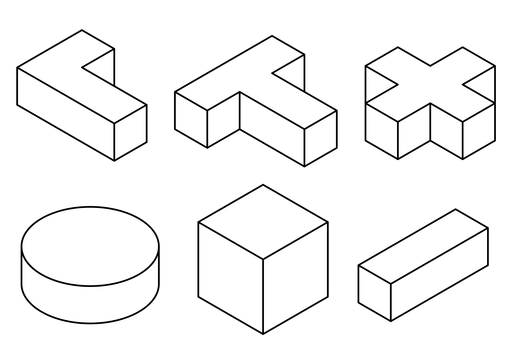

.. _state_based_global_pushing_env:

State-Based Global Pushing Environment
======================================

.. raw:: html

    

      <iframe width="320" height="180"
            src="https://www.youtube.com/embed/Y0U1cEfCQ9A?autoplay=1&mute=1&loop=1&playlist=Y0U1cEfCQ9A"
            frameborder="0"
            allow="accelerometer; autoplay; clipboard-write; encrypted-media; gyroscope; picture-in-picture"
            allowfullscreen></iframe>

      <iframe width="320" height="180"
            src="https://www.youtube.com/embed/GEhNS9mKXW8?autoplay=1&mute=1&loop=1&playlist=GEhNS9mKXW8"
            frameborder="0"
            allow="accelerometer; autoplay; clipboard-write; encrypted-media; gyroscope; picture-in-picture"
            allowfullscreen></iframe>
    

     

The ``StateBasedGlobalPushingEnv`` is an object manipulation environment designed for reinforcement learning with MagLev systems.
This environment allows agents to learn pushing tasks with various object shapes and supports both position-only and pose learning modes.
The term 'global' indicates that a global rather than a local motion planning strategy is learned.

The aim is to push an object with one or more movers to the desired goal position and/or orientation without collisions. A collision is 
detected, if any two movers collide or if at least one mover leaves the tiles (think of this as a collision with a wall). Starting 
positions of movers and objects, as well as object properties and goal configurations, are randomized at the start of each episode to 
ensure diverse training scenarios. The agent controls the movers by specifying either the jerk or acceleration. In this environment, 
positions, velocities, accelerations, and jerks have the units m, m/s, m/s² and m/s³, respectively.

Observation Space
-----------------

The observation space of this environment is a dictionary containing the following keys and values:

================ =============================================================================================================
Key              Value
================ =============================================================================================================
observation      - if ``learn_jerk=True``:
                   a numpy array of shape (num_movers * 6,) containing the (x,y)-position, (x,y)-velocities and
                   (x,y)-accelerations of each mover
                 - if ``learn_jerk=False``:
                   a numpy array of shape (num_movers * 4,) containing the (x,y)-position and (x,y)-velocities of
                   each mover
achieved_goal    - if ``learn_pose=False``:
                   a numpy array of shape (2,) containing the current (x,y)-position of the object
                 - if ``learn_pose=True``:
                   a numpy array of shape (4,) containing the current (x,y)-position and yaw orientation (sin, cos) of the object
desired_goal     - if ``learn_pose=False``:
                   a numpy array of shape (2,) containing the desired (x,y)-position of the object
                 - if ``learn_pose=True``:
                   a numpy array of shape (4,) containing the desired (x,y)-position and yaw orientation (sin, cos) of the object
================ =============================================================================================================

Action Space
------------

The action space is continuous and has dimensionality ``num_movers`` * 2. Actions directly specify the desired dynamic values
within the configured limits.

If ``learn_jerk=True``, an action

.. math::
    a_j = [a_{j1x}, a_{j1y}, ..., a_{jNx}, a_{jNy}]^T \in [-j_{max}, j_{max}]^{2N}

represents the desired jerks for N movers in x and y directions (unit: m/s³), where ``j_max`` is the maximum possible jerk.

If ``learn_jerk=False``, an action

.. math::
    a_a = [a_{a1x}, a_{a1y}, ..., a_{aNx}, a_{aNy}]^T \in [-a_{max}, a_{max}]^{2N}

represents the desired accelerations for N movers in x and y directions (unit: m/s²), where ``a_max`` is the maximum possible acceleration.

Immediate Rewards
-----------------

The reward function is designed to encourage efficient object manipulation while penalizing collisions:

- **Success reward**: 

  - if ``lean_pose=True``: ``object_at_goal_reward`` given when the object reaches its goal position without any collisions (default: +1.0)
  - if ``lean_pose=False``: The coverage achieved in the current timestep without any collisions, if ``use_sparse_pose_reward=False`` (``object_at_goal_reward`` is ignored),
    which is the default. Otherwise (``use_sparse_pose_reward=True``), ``object_at_goal_reward`` given when the object reaches its goal position without any collisions (default: +1.0).
- **Collision penalty** (``collision_penalty``, default: -10.0): Applied when a collision occurs
- **Step penalty** (``per_step_penalty``, default: -0.01): Small negative reward applied at each timestep to encourage efficiency

Goal achievement criteria:

- **Position mode** (``learn_pose=False``): Object position must be within ``max_position_err`` distance of the goal
- **Pose mode** (``learn_pose=True``): Object must achieve at least ``min_coverage`` overlap ratio with the desired pose

Episode Termination and Truncation
-----------------------------------

Episodes terminate under the following conditions:

1. **Early termination**: When ``early_termination_steps`` is set and the object remains at goal for the specified number of consecutive steps
2. **Time limit**: Episodes are truncated after reaching the maximum number of steps (typically managed by Gymnasium's TimeLimit wrapper)
3. **Collision**: Episodes terminate immediately when a collision occurs.

.. note::
    The term 'episode steps' refers to the number of calls to ``env.step()``. Each step consists of ``num_cycles`` MuJoCo
    simulation steps.

Environment Reset
-----------------

When the environment is reset, the following randomization occurs:

1. **Object properties**: Type, dimensions, mass, and orientation can be sampled from configured ranges. For more information, please see the following section on object shapes.
2. **Object placement**: Start and goal positions are randomly chosen within valid boundaries
3. **Mover placement**: Initial positions are sampled ensuring collision-free placement
4. **Collision avoidance**: The system ensures sufficient distance between movers and objects, and between object start/goal positions

The reset process includes validation to ensure:

- No initial collisions between movers and walls, i.e. each mover is above a tile
- No initial collisions between movers and the object
- Sufficient space for movers to maneuver around the object
- Minimum distance between object start and goal positions

Object Shapes
-------------

The environment supports six different object shapes:

- **square_box**: Square box with equal width and height
- **box**: Rectangular box with different width and height
- **cylinder**: Cylindrical object
- **t_shape**: T-shaped object composed of multiple box segments
- **l_shape**: L-shaped object with vertical and horizontal segments
- **plus_shape**: Plus/X-shaped object with perpendicular segments

   Overview of all supported object types.

In the default configuration, all object parameters are fixed, and the default object is a square box.
To use the environment with another object shape, set ``object_type`` to one of the object shapes listed above. 
These object shapes are parameterized with min and max values (min, max), and the environment automatically 
selects new object parameters at random if min < max applies for a parameter range. The parameter ranges can 
be changed by setting new values using ``object_ranges``. 

The following object parameters can be configured:

- **w**: Width of the object (or object segments) in m (default: (0.06, 0.06))
- **h**: Height of the object (or object segments) in m (default: (0.06, 0.06))
- **r**: Radius for cylindrical objects in m (default: (0.02, 0.02))
- **s**: Segment width for composite shapes (T, L, plus) in m (default: (0.02, 0.02))
- **d**: Depth parameter for segment positioning in composite shapes in m (default: (0.05, 0.05))
- **mass**: Mass of the object in kg (default: (0.3, 0.3))

.. figure:: ../_static/envs/img_object_geometry_labeled.png
   :align: center
   :width: 40%

Basic Usage
-----------
The following example shows how to train an agent using `Stable-Baselines3 <https://stable-baselines3.readthedocs.io/en/master/>`_. To use the example, please install Stable-Baselines3 as
described in the `documentation <https://stable-baselines3.readthedocs.io/en/master/guide/install.html>`_.

.. note::
    This is a simplified example that is not guaranteed to converge, as the default parameters are used. However, it is important to note that
    the parameter ``copy_info_dict`` is set to ``True``. This way, it is not necessary to check for collision again to compute the reward when a
    transition is relabeled by HER, since the information is already available in the ``info``-dict.

.. code-block:: python

    import numpy as np
    import gymnasium as gym
    from stable_baselines3 import SAC, HerReplayBuffer
    import magbotsim

    gym.register_envs(magbotsim)

    render_mode = None
    mover_params = {'size': np.array([0.113 / 2, 0.113 / 2, 0.012 / 2]), 'mass': 0.628}
    collision_params = {'shape': 'box', 'size': np.array([0.113 / 2 + 1e-6, 0.113 / 2 + 1e-6]), 'offset': 0.0, 'offset_wall': 0.0}
    env_params = {'mover_params': mover_params, 'collision_params': collision_params, 'render_mode': render_mode}

    env = gym.make('StateBasedObjectPushingEnv-v0', **env_params)
    # copy_info_dict=True, as information about collisions is stored in the info dictionary to avoid
    # computationally expensive collision checking calculations when the data is relabeled (HER)
    model = SAC(
        policy='MultiInputPolicy',
        env=env,
        replay_buffer_class=HerReplayBuffer,
        replay_buffer_kwargs={'copy_info_dict': True},
        verbose=1
    )
    model.learn(total_timesteps=int(1e6))

Version History
---------------
- v0: initial version of the environment

Parameters
----------
.. automodule:: magbotsim.rl_envs.object_manipulation.pushing.state_based_global_pushing_env
  :members:
  :no-index:
  :show-inheritance:
