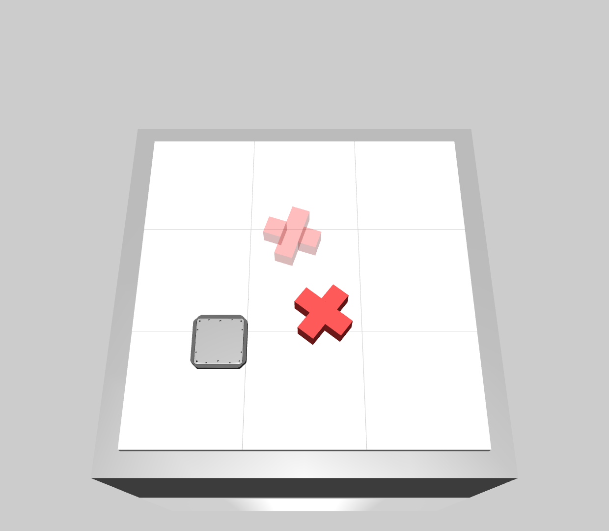

.. _state_based_push_x_env:

State-Based Push-X Environment
==============================

The ``StateBasedPushXEnv`` is an object pushing environment with an X-shaped object:

The Push-X task is a manipulation benchmark where the goal is to push an X-shaped object to a target
pose (position and orientation). Similar to the Push-T task, this challenge requires precise control to achieve
both translational and rotational alignment of the asymmetric object. The X-shape presents unique symmetry properties
compared to the T-shape and L-shape, with its four-fold rotational symmetry making orientation alignment particularly
interesting.

This environment is a preconfigured version of :ref:`state_based_global_pushing_env` specifically designed for the
Push-X manipulation task. Please refer to the :ref:`state_based_global_pushing_env` for additional information about
the observation space, action space, immediate rewards, episode termination/truncation, and environment reset.

Basic Usage
-----------
The following example shows how to train an agent using `Stable-Baselines3 <https://stable-baselines3.readthedocs.io/en/master/>`_. To use the example, please install Stable-Baselines3 as
described in the `documentation <https://stable-baselines3.readthedocs.io/en/master/guide/install.html>`_.

.. note::
    This is a simplified example that is not guaranteed to converge, as the default parameters are used. However, it is important to note that
    the parameter ``copy_info_dict`` is set to ``True``. This way, it is not necessary to check for collision again to compute the reward when a
    transition is relabeled by HER, since the information is already available in the ``info``-dict.

.. code-block:: python

    import numpy as np
    import gymnasium as gym
    from stable_baselines3 import SAC, HerReplayBuffer
    import magbotsim

    gym.register_envs(magbotsim)

    render_mode = None
    mover_params = {'size': np.array([0.155 / 2, 0.155 / 2, 0.012 / 2]), 'mass': 1.24}
    collision_params = {'shape': 'box', 'size': np.array([0.155 / 2 + 1e-6, 0.155 / 2 + 1e-6]), 'offset': 0.0, 'offset_wall': 0.0}
    env_params = {'mover_params': mover_params, 'collision_params': collision_params, 'render_mode': render_mode}

    env = gym.make('StateBasedPushXEnv-v0', **env_params)
    # copy_info_dict=True, as information about collisions is stored in the info dictionary to avoid
    # computationally expensive collision checking calculations when the data is relabeled (HER)
    model = SAC(
        policy='MultiInputPolicy',
        env=env,
        replay_buffer_class=HerReplayBuffer,
        replay_buffer_kwargs={'copy_info_dict': True},
        verbose=1
    )
    model.learn(total_timesteps=int(1e6))

Version History
---------------
- v0: initial version of the environment

Parameters
----------
.. automodule:: magbotsim.rl_envs.object_manipulation.pushing.state_based_push_x_env
  :members:
  :no-index:
  :show-inheritance:
