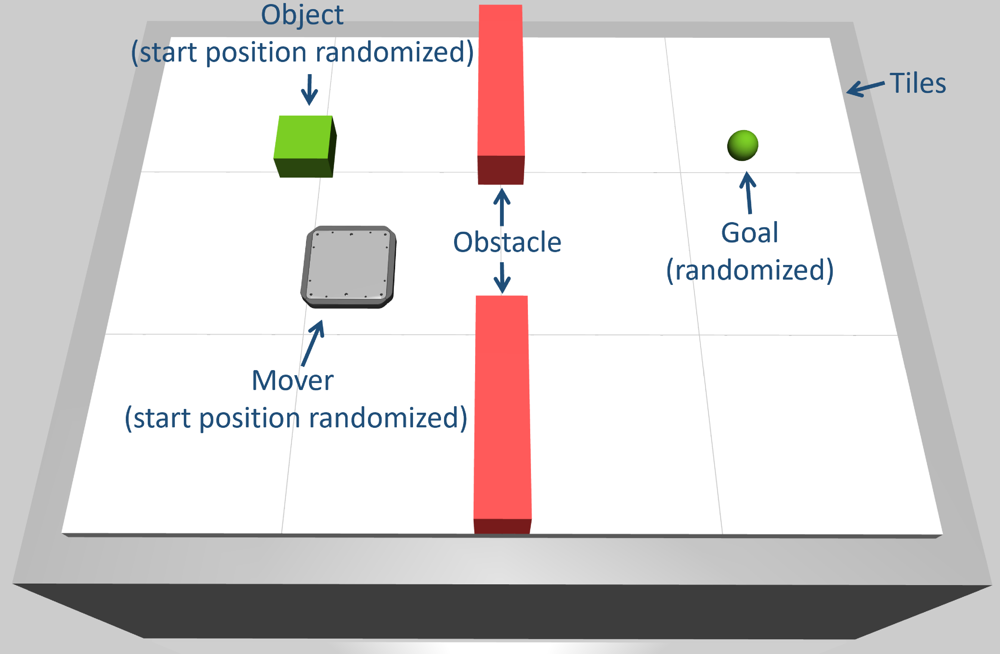
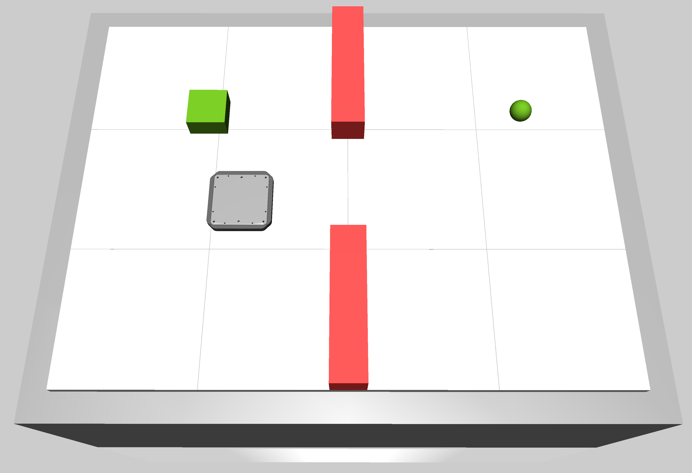

.. _state_based_pushing_with_static_obstacle_env:

State-Based Pushing Environment with Static Obstacles
=====================================================

.. raw:: html

    

        <iframe width="320" height="180"
                    src="https://www.youtube.com/embed/qdemULBGtFc?autoplay=1&mute=1&loop=1&playlist=qdemULBGtFc"
                    frameborder="0"
                    allow="accelerometer; autoplay; clipboard-write; encrypted-media; gyroscope; picture-in-picture"
                    allowfullscreen></iframe>
    

     

The ``StateBasedStaticObstaclePushingEnv`` is a simple pushing environment with two static obstacles.
The aim is to push the object with the mover to the desired goal position without collisions by specifying either the jerk or the 
acceleration of the mover. A collision is detected, if the mover leaves the tiles (think of this as a collision with a wall) or if the
mover or the object collide with one of the obstacles.

The difficulty of the task can be adjusted by changing the size of the obstacles, i.e. the larger the obstacles, the greater the difficulty.
The size of the obstacles can be changed by setting the ``obstacle_mode``. The following modes are available:

- **simple**:

.. image:: ../_static/envs/img_state_based_static_obstacle_pushing_env_simple.png
    :width: 20%

- **medium**:
    
.. image:: ../_static/envs/img_state_based_static_obstacle_pushing_env_medium.png
    :width: 20%

- **hard**:

- **random**:
    The size of the obstacles is chosen uniformly at random. The minimum obstacle size is the one used in the ``obstacle_mode`` ``simple``. 
    The maximum obstacle size is the one used in the ``obstacle_mode`` ``hard``.

- **curriculum**:
    Increases the size of the obstacle using a curriculum. The curriculum is kept simple. The initial ``obstacle_mode`` is ``simple``. 
    After 800 episodes, the ``obstacle_mode`` is automatically set to ``medium``. After an additional 800 episodes, the ``obstacle_mode`` is 
    changed to ``hard`` for the remaining episodes.

The start positions of the mover and object as well as the object's goal position are chosen randomly at the start of a new episode.
This environment contains only one object and one mover. The tiles are arranged in a 4x3 layout. In this environment, 
positions, velocities, accelerations, and jerks have the units m, m/s, m/s² and m/s³, respectively.

Observation Space
-----------------
The observation space of this environment is a dictionary containing the following keys and values:

================ =============================================================================================================
Key              Value
================ =============================================================================================================
observation      - if ``learn_jerk=True``:                                                                                  
                   a numpy array of shape (22,) containing the (x,y)-position, (x,y)-velocities, (x,y)-accelerations        
                   of the mover, as well as the x and y positions of the vertices of both obstacles                         
                 - if ``learn_jerk=False``:                                                                                 
                   a numpy array of shape (20,) containing the (x,y)-position and (x,y)-velocities, (x,y)-accelerations     
                   of the mover, as well as the x and y positions of the vertices of both obstacles                         
achieved_goal    a numpy array of shape (2,) containing the current (x,y)-position of the object w.r.t. the base frame      
desired_goal     a numpy array of shape (2,) containing the desired (x,y)-position of the object w.r.t. the base frame      
================ =============================================================================================================

Action Space
------------
The action space is continuous and 2-dimensional. If ``learn_jerk=True``, an action

.. math::
    a_j = [a_{jx}, a_{jy}]^T \in [-j_{max},j_{max}]²

represents the desired jerks in x and y direction of the base frame (unit: m/s³), where ``j_max`` is the maximum possible jerk (see
environment parameters).

Accordingly, if ``learn_jerk=False``, an action

.. math::
    a_a = [a_{ax}, a_{ay}]^T \in [-a_{max},a_{max}]²

represents the accelerations in x and y direction of the base frame (unit: m/s²), where ``a_max`` is the maximum possible acceleration
(see environment parameters).

Immediate Rewards
-----------------
The agent receives a reward of 0 if the object has reached its goal without a collision.
For each timestep in which the object has not reached its goal and in which there is no collision, the environment emits a small negative reward of -1.
In the case of a collision, the agent receives a large negative reward of -50.

Episode Termination and Truncation
----------------------------------
Each episode has a time limit of 25 environment steps. If the time limit is reached, the episode is truncated. Thus, each episode
has 25 environment steps, except that the mover collides with a wall. In this case, the episode terminates immediately
regardless of the time limit. An episode is not terminated when the object reaches its goal position, as the object has to remain close
to the desired goal position until the end of an episode.

.. note::
    The term 'episode steps' refers to the number of calls of ``env.steps()``. The number of MuJoCo simulation steps, i.e. control
    cycles, is a multiple of the number of episode steps.

Environment Reset
-----------------
When the environment is reset, new (x,y) start positions for the mover and the object as well as a new goal position are chosen at
random. It is ensured that the new start position of the mover is collision-free. In addition, the object's start position is chosen such that the mover fits between the wall and the object. This is important
to ensure that the object can be pushed in all directions.

Basic Usage
-----------
The following example shows how to train an agent using `Stable-Baselines3 <https://stable-baselines3.readthedocs.io/en/master/>`_. To use the example, please install Stable-Baselines3 as 
described in the `documentation <https://stable-baselines3.readthedocs.io/en/master/guide/install.html>`_.

.. note::
    This is a simplified example that is not guaranteed to converge, as the default parameters are used. However, it is important to note that 
    the parameter ``copy_info_dict`` is set to ``True``. This way, it is not necessary to check for collision again to compute the reward when a 
    transition is relabeled by HER, since the information is already available in the ``info``-dict. 

.. code-block:: python

    import numpy as np
    import gymnasium as gym
    from stable_baselines3 import SAC, HerReplayBuffer
    import magbotsim

    render_mode = None
    mover_params = {'size': np.array([0.113 / 2, 0.113 / 2, 0.012 / 2]), 'mass': 0.628}
    collision_params = {'shape': 'box', 'size': np.array([0.113 / 2 + 1e-6, 0.113 / 2 + 1e-6]), 'offset': 0.0, 'offset_wall': 0.0}
    env_params = {'mover_params': mover_params, 'collision_params': collision_params, 'render_mode': render_mode}

    env = gym.make('StateBasedStaticObstaclePushingEnv-v0', **env_params)
    # copy_info_dict=True, as information about collisions is stored in the info dictionary to avoid 
    # computationally expensive collision checking calculations when the data is relabeled (HER)
    model = SAC(
        policy='MultiInputPolicy',
        env=env,
        replay_buffer_class=HerReplayBuffer,
        replay_buffer_kwargs={'copy_info_dict': True},
        verbose=1
    )
    model.learn(total_timesteps=int(1e6))

Version History
---------------
- v0: initial version of the environment

Parameters
----------
.. automodule:: magbotsim.rl_envs.object_manipulation.pushing.state_based_static_obstacle_env
  :members:
  :no-index:
  :show-inheritance: