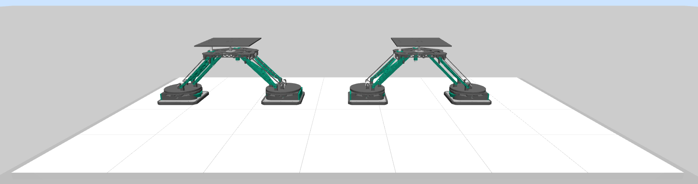

.. _magbot_tutorial:

Adding MagBots to a Custom Environment
======================================

In this tutorial, we show how to add two 6D-Platform MagBots to a custom environment. The very basic idea is that a MagBotSim parent class is chosen 
(see tutorial :ref:`choosing_parent_class` for more information) and an instance of a specific MagBot class is initialized in the custom environment.

Getting Started
---------------
First, we need to create a file for our custom environment. Navigate to the directory where your environment file should be 
located and create a new file called ``magbot_example_env.py``.

Initializing the Environment
----------------------------
The next step is to decide which MagBotSim parent class is required (see tutorial :ref:`choosing_parent_class` for more information). 
To keep our example environment simple, we do not use RL. Thus, we choose the ``BasicMagBotEnv`` as the parent class.
Write the following code in ``magbot_example_env.py``:

.. code-block:: python

    import numpy as np
    import mujoco
    from magbotsim import BasicMagBotEnv, SixDPlatformMagBotsAPM4330, MoverImpedanceController

    class SixDPlatformMagBotExampleEnv(BasicMagBotEnv):
        """Simple example environment with two 6D-Platform MagBots."""

        def __init__(self) -> None:
            # mover parameters, collision parameters and initial start positions
            mover_mass = np.array([1.264] * 4)
            bumper_mass = np.array([0.05] * 4)
            mover_params = {
                'shape': 'mesh',
                'mesh': {'mover_stl_path': ['beckhoff_apm4330_mover'] * 4, 'bumper_stl_path': ['beckhoff_apm4330_bumper'] * 4},
                'mass': mover_mass - bumper_mass,
                'bumper_mass': bumper_mass,
            }
            # we model the mover as a simple 2D box to check collisions
            # since we are using Beckhoff XPlanar movers (APM4330), we
            # use the sizes specified in the technical drawings plus a safety margin
            collision_params = {'shape': 'box', 'size': np.array([[0.155 / 2, 0.155 / 2]] * 4) + 0.001}

            self.initial_mover_x_dist = 0.4027  # [m]
            self.initial_mover_start_xy_pos = np.array(
                [
                    [0.36, 0.36],
                    [0.36 + self.initial_mover_x_dist, 0.36],
                    [1.1, 0.36],
                    [1.1 + self.initial_mover_x_dist, 0.36],
                ]
            )
            self.initial_mover_z_pos = 0.001

            # MagBots
            self.num_magbots = 2 # <-- number of MagBots in this environment
            self.indices_mover_a = np.array([0, 2]) # <-- movers controlling the alpha rotation of the platforms
            self.indices_mover_b = np.array([1, 3]) # <-- movers controlling the beta rotation of the platforms      

            # init BasicMagBotEnv
            super().__init__(
                layout_tiles=np.ones((7, 4)),
                num_movers=4,
                mover_params=mover_params,
                initial_mover_zpos=self.initial_mover_z_pos,
                table_height=0.2,
                collision_params=collision_params,
                initial_mover_start_xy_pos=self.initial_mover_start_xy_pos,
                custom_model_xml_strings=None,
                use_mj_passive_viewer=True,
            )

            # impedance controller
            self.impedance_controllers = [
                MoverImpedanceController(
                    model=self.model,
                    mover_joint_name=self.mover_joint_names[mover_idx],
                    mover_half_height=self.mover_size[mover_idx, 2],
                    joint_mask=np.array([1, 1, 1, 1, 1, 1]),
                    translational_stiffness=np.array([100.0, 100.0, 10.0]),
                    rotational_stiffness=np.array([1.0, 1.0, 5.0]),
                )
                for mover_idx in range(self.num_movers)
            ]

We initialized a custom environment called ``SixDPlatformMagBotExampleEnv`` which inherits from the ``BasicMagBotSimEnv``. We added 28 tiles by specifying a 
7x4 tile grid and four movers to the environment. Besides, we specified how many MagBots belong to this environment and which movers control the :math:`\alpha`- 
and :math:`\beta`-rotations of the platform. So far, nothing really new happened.

Adding MagBots to the MuJoCo Model
----------------------------------
As usual, we customize the MuJoCo model by using the ``_custom_xml_string_callback``. To add the MagBots and actuators, paste the following code to your ``SixDPlatformMagBotExampleEnv``:

.. code-block:: python

    def _custom_xml_string_callback(self, custom_model_xml_strings: dict[str, str] | None = None) -> dict[str, str]:
        """Add the MagBots and actuators for the movers to the MuJoCo model by modifying the ``custom_model_xml_strings``-dict.

        :param custom_model_xml_strings: the current ``custom_model_xml_strings``-dict which is modified by this callback, defaults to None
        :return: the modified ``custom_model_xml_strings``-dict
        """
        if custom_model_xml_strings is None:
            custom_model_xml_strings = {}
            custom_model_xml_strings.update({'custom_mover_body_xml_str_list': [None] * self.num_movers})

        if hasattr(self, 'mover_joint_names'):
            mover_qpos = self.get_mover_qpos(mover_names=self.mover_names, add_noise=False)
            # generate custom model XML strings for the two MagBots
            self.magbots = SixDPlatformMagBotsAPM4330(
                num_magbots=self.num_magbots, indices_mover_a=self.indices_mover_a, indices_mover_b=self.indices_mover_b
            )
            custom_model_xml_strings = self.magbots.generate_magbot_xml_strings(
                initial_pos_xyz_mover_b=mover_qpos[self.indices_mover_b, :3], custom_model_xml_strings=custom_model_xml_strings
            )

            # add actuators
            actuator_lines = ['\n\n\t<actuator>']
            # mover actuators
            for idx_mover in range(0, self.num_movers):
                actuator_lines.append(f'\n\t\t<!-- actuators mover {idx_mover} -->')
                actuator_lines.append(self.impedance_controllers[idx_mover].generate_actuator_xml_string(idx_mover=idx_mover))
                actuator_lines.append('\n')
            # MagBot platform a,b rot actuators
            actuator_lines.append(self.magbots.generate_platform_abRot_actuator_xml_strings())
            # join
            actuator_lines.append('\n\t</actuator>')
            custom_outworldbody_xml_str = custom_model_xml_strings.get('custom_outworldbody_xml_str', None)
            custom_model_xml_strings['custom_outworldbody_xml_str'] = custom_outworldbody_xml_str + ''.join(actuator_lines)

        return custom_model_xml_strings

    def reload_model(self, mover_start_xy_pos: np.ndarray) -> None:
        """Generate a new model XML string with new start positions for movers.

        :param mover_start_xy_pos: None or a numpy array of shape (num_movers,2) containing the (x,y) starting positions of each mover
        """
        assert np.allclose(mover_start_xy_pos[1, 0] - mover_start_xy_pos[0, 0], self.initial_mover_x_dist)
        assert np.allclose(mover_start_xy_pos[3, 0] - mover_start_xy_pos[2, 0], self.initial_mover_x_dist)
        # generate a new model XML string
        custom_model_xml_strings = self._custom_xml_string_callback(custom_model_xml_strings=self.custom_model_xml_strings_before_cb)
        model_xml_str = self.generate_model_xml_string(
            mover_start_xy_pos=mover_start_xy_pos, mover_goal_xy_pos=None, custom_xml_strings=custom_model_xml_strings
        )
        # compile the MuJoCo model
        self.model = mujoco.MjModel.from_xml_string(model_xml_str)
        self.data = mujoco.MjData(self.model)
        mujoco.mj_forward(self.model, self.data)

        # update cached mujoco data
        self.update_cached_mover_mujoco_data()
        for idx_mover in range(0, self.num_movers):
            self.impedance_controllers[idx_mover].update_cached_mujoco_data(self.model)
        self.magbots.update_cached_mujoco_data(self.model)

        # render the environment after reloading
        if self.render_mode is not None:
            self.viewer_collection.reload_model(self.model, self.data)
        self.render()

The very basic idea should be familiar (see tutorial :ref:`customizing_mujoco_model`). The important thing to note here is that the ``SixDPlatformMagBotsAPM4330``
class can handle multiple MagBots of the same type. This enables vectorized calculations.
Additionally, add the following code at the end of ``SixDPlatformMagBotExampleEnv.init()`` to reload your model with the MagBots:

.. code-block:: python

    # reload model to add MagBots and actuators
    self.reload_model(mover_start_xy_pos=self.initial_mover_start_xy_pos)

You should now see a custom example environment with two 6D-Platform MagBots:

Controlling the MagBots
-----------------------
To control the MagBots in simulation and perform collision checking, add the following code to your ``SixDPlatformMagBotExampleEnv``:

.. code-block:: python

    def step(self, platform_setposes: np.ndarray, num_cycles: int = 40, render_every_cycle: bool = False) -> None:
        """Perform one or multiple simulation steps, including caluclation of mover controls, MuJoCo integrator steps, rendering, and
        collision checking.

        :param platform_setposes: the desired target positions of the MagBot platforms (numpy array of shape (num_magbots, 6) using Euler
            angles (xyz) in rad)
        :param num_cycles: the number of control cycles for which to apply the same controls, defaults to 40
        :param render_every_cycle: whether to call ``render()`` after each integrator step in the ``step()`` method, defaults to
            False. Rendering every cycle leads to a smoother visualization of the scene, but can also be computationally expensive.
            Thus, this parameter provides the possibility to speed up training and evaluation. Regardless of this parameter, the scene
            is always rendered after ``num_cycles``.
        """
        assert platform_setposes.shape == (self.num_magbots, 6)

        for _ in range(0, num_cycles):
            # calculate controls
            # platform set pose to mover set pose
            mover_poses = self.magbots.platformSetPose2MoverSetPose(
                platform_pose_d=platform_setposes, mover_z_d=self.initial_mover_zpos, use_euler=False
            )
            # update controls for mover impedance controllers
            mover_poses_tmp = mover_poses.reshape((self.num_movers, 7))
            for idx_mover in range(0, self.num_movers):
                self.impedance_controllers[idx_mover].update(
                    model=self.model,
                    data=self.data,
                    pos_d=mover_poses_tmp[idx_mover, :3],
                    quat_d=mover_poses_tmp[idx_mover, 3:],
                    additional_mass=self.magbots.magbot_masses[0] / 2,
                )
            # coupling: mover rotation <-> platform rotation
            current_mover_poses = self.get_mover_qpos(mover_names=self.mover_names, add_noise=False)
            self.magbots.control_platform_ab_rot(
                model=self.model,
                data=self.data,
                mover_a_quats=current_mover_poses[self.indices_mover_a, 3:],
                mover_b_quats=current_mover_poses[self.indices_mover_b, 3:],
            )
            # integration
            mujoco.mj_step(self.model, self.data, nstep=1)
            # render every cycle for a smooth visualization of the movement
            if render_every_cycle:
                self.render()
            # check wall and mover collision every cycle to ensure that the collisions are detected and
            # all intermediate mover positions are valid and without collisions
            wall_collision = self.check_wall_collision(
                mover_names=self.mover_names,
                c_size=self.c_size,
                add_safety_offset=False,
                mover_qpos=None,
                add_qpos_noise=True,  # would also occur in a real system
            ).any()
            mover_collision = self.check_mover_collision(
                mover_names=self.mover_names,
                c_size=self.c_size,
                add_safety_offset=False,
                mover_qpos=None,
                add_qpos_noise=True,  # would also occur in a real system
            )
            if mover_collision or wall_collision:
                break
        self.render()

Again, the very basic idea should be familiar (see tutorial :ref:`apply_controls_and_collision_checking_tutorial`). The only important thing here is that 
we need to take care of the coupling between the mover and platform rotation.

You can now move the MagBots by specifying platform set positions by adding the following code at the end of your ``magbot_example_env.py``-file:

.. code-block:: python

    if __name__ == '__main__':
        fR = 0.08  # radius of the circle
        fTime = 0.0
        platform_setposes = np.array(
            [
                [0.48 + fR, 0.36, 0.24, np.deg2rad(0.0), 0.0, 0.0],  # XYCircleZSin
                [0.36 + 0.96, 0.36, 0.2661825, 0.0, 0.0, np.deg2rad(-45.0)],  # wave
            ]
        )

        env = SixDPlatformMagBotExampleEnv()

        num_cycles = 15
        try:
            while True:
                # xy circle + z sin movement
                platform_setposes[0, 0] = 0.48 + fR * np.cos(fTime)
                platform_setposes[0, 1] = 0.36 + fR * np.sin(fTime)
                platform_setposes[0, 2] = 0.03 * np.sin(3.5 * fTime) + 0.24
                # wave movement
                platform_setposes[1, 3] = np.cos(2.0 * fTime)
                platform_setposes[1, 4] = np.sin(2.0 * fTime)
                # env step (integration, collision checking, rendering)
                env.step(platform_setposes=platform_setposes, num_cycles=num_cycles, render_every_cycle=False)
                fTime += 0.001 * num_cycles
        except KeyboardInterrupt:
            pass
        finally:
            env.close()