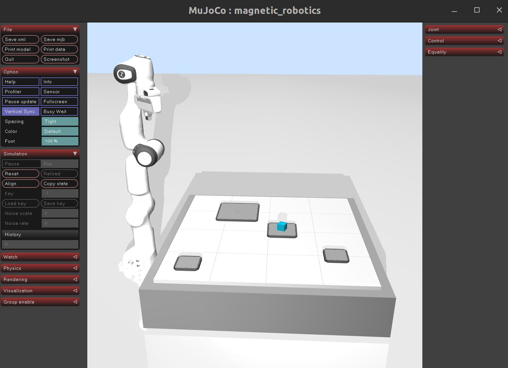

.. _customizing_mujoco_model:

Customizing the MuJoCo Model
============================

MuJoCo uses the MJCF modeling language to create models. MJCF files are basically XML files that describe
the physics of the environment and objects within that environment.
Please refer to the `MuJoCo documentation <https://mujoco.readthedocs.io/en/stable/XMLreference.html>`_ for more information
about the MJCF model language.

MagBotSim generates a MuJoCo XML string to define the MuJoCo model. We decided to use XML strings instead of XML files, as
loading an XML file is slower than generating an XML string. Since a reset of an (RL) environment might require building
and compiling a new model to ensure that the new model is physically correct, e.g. if the size of an object to be manipulated
is changed, a new XML model might be generated frequently. Therefore, the generation process must be as fast as possible
to avoid slowing down training and evaluation. The MuJoCo XML string can be customized by defining additional XML
strings, e.g. user-defined actuators for the movers, sensors, objects, or robots, that are automatically added to a
user-defined mover-tile configuration by MagBotSim. In this way, a simulation of a specific (industrial) application can be created.

In this tutorial, we show how to customize the MuJoCo XML string. We will add a Franka Emika Panda robot and a box carried
by one of the movers to the ``PandaBoxExampleEnv`` that we created in the previous tutorial :ref:`creating_env`.

MagBotSim automatically creates an XML string with the specified number of movers and tiles, some useful assets, and default options.
Let's see what this looks like for our ``PandaBoxExampleEnv``. The MuJoCo model XML string currently only contains tiles and movers,
since we have not yet added the robot and the box, and it looks like this:

.. code-block:: xml

    <?xml version="1.0" encoding="utf-8"?>
    <mujoco model="magnetic_robotics">
        <compiler angle="radian" coordinate="local" meshdir="/home/MagBotSim/magbotsim/assets/meshes"/>
        <visual>
            <scale framelength="0.7" framewidth="0.05"/>
        </visual>
        <option timestep="0.001" cone="elliptic" jacobian="auto" gravity="0 0 -9.81"/>

        <asset>
            <material name="white" reflectance="0.01" shininess="0.01" specular="0.1" rgba="1 1 1 1" />
            <material name="off_white" reflectance="0.01" shininess="0.01" specular="0.1" rgba="0.7 0.7 0.7 1" />
            <material name="gray" reflectance="1" shininess="1" specular="1" rgba="0.5 0.5 0.5 1"/>
            <material name="black" reflectance="0.01" shininess="0.01" specular="0.1" rgba="0.25 0.25 0.25 1" />
            <material name="light_green" reflectance="0.01" shininess="0.01" specular="0.1" rgba="0.2852 0.5078 0.051 1" />
            <material name="green" reflectance="0.01" shininess="0.01" specular="0.1" rgba="0 0.42 0.33 1" />
            <material name="red" reflectance="0.01" shininess="0.01" specular="0.1" rgba="0.94 0.191 0.191 1" />
            <material name="red_transparent" reflectance="0.01" shininess="0.01" specular="0.1" rgba="1 0 0 0.15" />
            <material name="yellow" reflectance="0.01" shininess="0.01" specular="0.1" rgba="0.98 0.94 0.052 1" />
            <material name="orange" reflectance="0.01" shininess="0.01" specular="0.1" rgba="0.98 0.39 0 1" />
            <material name="dark_blue" reflectance="0.01" shininess="0.01" specular="0.1" rgba="0 0 1 1" />
            <material name="light_blue" reflectance="0.01" shininess="0.01" specular="0.1" rgba="0.492 0.641 0.98 1" />
            <material name="blue" reflectance="0.01" shininess="0.01" specular="0.1" rgba="0. 0.543 0.649 1" />
            <material name="floor_mat" reflectance="0.05" shininess="0.05" specular="0.1" texture="texplane" texuniform="true" />
            <material name="line_mat" reflectance="0.01" shininess="0.01" specular="0.1" rgba="0.5 0.5 0.5 1"/>
            <texture name="texplane" builtin="flat" height="256" width="256" rgb1=".8 .8 .8" rgb2=".8 .8 .8" />
            <texture type="skybox" builtin="gradient" rgb1="0.8 0.898 1" rgb2="0.8 0.898 1" width="32" height="32" />
            <mesh name="mover_mesh_0" file="./mover_and_bumper/beckhoff_apm4330_mover.stl" scale="1 1 1" />
            <mesh name="bumper_mesh_0" file="./mover_and_bumper/beckhoff_apm4330_bumper.stl" scale="1 1 1" />
            <mesh name="mover_mesh_1" file="./mover_and_bumper/beckhoff_apm4220_mover.stl" scale="1 1 1" />
            <mesh name="bumper_mesh_1" file="./mover_and_bumper/beckhoff_apm4220_bumper.stl" scale="1 1 1" />
            <mesh name="mover_mesh_2" file="./mover_and_bumper/beckhoff_apm4220_mover.stl" scale="1 1 1" />
            <mesh name="bumper_mesh_2" file="./mover_and_bumper/beckhoff_apm4220_bumper.stl" scale="1 1 1" />
            <mesh name="mover_mesh_3" file="./mover_and_bumper/beckhoff_apm4550_mover.stl" scale="1 1 1" />
            <mesh name="bumper_mesh_3" file="./mover_and_bumper/beckhoff_apm4550_bumper.stl" scale="1 1 1" />
        </asset>

        <default>
            <default class="magnetic_robotics">
                <default class="tile">
                    <geom type="box" size="0.12 0.12 0.0176" mass="5.6" material="off_white" />
                </default>
            </default>
        </default>

        <worldbody>
            <light directional="true" ambient="0.2 0.2 0.2" diffuse="0.8 0.8 0.8" specular="0.3 0.3 0.3" castshadow="false" pos="0 0 4" dir="0 0 -1" name="light0"/>
            <geom name="ground_plane" pos="0.48 0.48 -0.23520000000000002" type="plane" size="10 10 10" material="floor_mat"/>
            <geom name="table" pos="0.48 0.48 -0.11760000000000001" size="0.53 0.53 0.1" type="box" material="gray" mass="20"/>

            <!-- tiles -->
            <body name="tile_body" childclass="magnetic_robotics" pos="0 0 -0.0176" gravcomp="1">
                <geom name="tile_0_0" class="tile"  pos="0.12 0.12 0"/>
                <geom name="tile_0_1" class="tile"  pos="0.12 0.36 0"/>
                <geom name="tile_0_2" class="tile"  pos="0.12 0.6 0"/>
                <geom name="tile_0_3" class="tile"  pos="0.12 0.84 0"/>
                <geom name="tile_1_0" class="tile"  pos="0.36 0.12 0"/>
                <geom name="tile_1_1" class="tile"  pos="0.36 0.36 0"/>
                <geom name="tile_1_2" class="tile"  pos="0.36 0.6 0"/>
                <geom name="tile_1_3" class="tile"  pos="0.36 0.84 0"/>
                <geom name="tile_2_0" class="tile"  pos="0.6 0.12 0"/>
                <geom name="tile_2_1" class="tile"  pos="0.6 0.36 0"/>
                <geom name="tile_2_2" class="tile"  pos="0.6 0.6 0"/>
                <geom name="tile_2_3" class="tile"  pos="0.6 0.84 0"/>
                <geom name="tile_3_0" class="tile"  pos="0.84 0.12 0"/>
                <geom name="tile_3_1" class="tile"  pos="0.84 0.36 0"/>
                <geom name="tile_3_2" class="tile"  pos="0.84 0.6 0"/>
                <geom name="tile_3_3" class="tile"  pos="0.84 0.84 0"/>

                <!-- lines -->
                <site type="box" size="0.0005" material="line_mat" fromto="0.0 0.24 0.01711 0.24 0.24 0.01711" />
                <site type="box" size="0.0005" material="line_mat" fromto="0.0 0.48 0.01711 0.24 0.48 0.01711" />
                <site type="box" size="0.0005" material="line_mat" fromto="0.0 0.72 0.01711 0.24 0.72 0.01711" />
                <site type="box" size="0.0005" material="line_mat" fromto="0.24 0.0 0.01711 0.24 0.24 0.01711" />
                <site type="box" size="0.0005" material="line_mat" fromto="0.24 0.24 0.01711 0.24 0.48 0.01711" />
                <site type="box" size="0.0005" material="line_mat" fromto="0.24 0.24 0.01711 0.48 0.24 0.01711" />
                <site type="box" size="0.0005" material="line_mat" fromto="0.24 0.48 0.01711 0.24 0.72 0.01711" />
                <site type="box" size="0.0005" material="line_mat" fromto="0.24 0.48 0.01711 0.48 0.48 0.01711" />
                <site type="box" size="0.0005" material="line_mat" fromto="0.24 0.72 0.01711 0.24 0.96 0.01711" />
                <site type="box" size="0.0005" material="line_mat" fromto="0.24 0.72 0.01711 0.48 0.72 0.01711" />
                <site type="box" size="0.0005" material="line_mat" fromto="0.48 0.0 0.01711 0.48 0.24 0.01711" />
                <site type="box" size="0.0005" material="line_mat" fromto="0.48 0.24 0.01711 0.48 0.48 0.01711" />
                <site type="box" size="0.0005" material="line_mat" fromto="0.48 0.24 0.01711 0.72 0.24 0.01711" />
                <site type="box" size="0.0005" material="line_mat" fromto="0.48 0.48 0.01711 0.48 0.72 0.01711" />
                <site type="box" size="0.0005" material="line_mat" fromto="0.48 0.48 0.01711 0.72 0.48 0.01711" />
                <site type="box" size="0.0005" material="line_mat" fromto="0.48 0.72 0.01711 0.48 0.96 0.01711" />
                <site type="box" size="0.0005" material="line_mat" fromto="0.48 0.72 0.01711 0.72 0.72 0.01711" />
                <site type="box" size="0.0005" material="line_mat" fromto="0.72 0.0 0.01711 0.72 0.24 0.01711" />
                <site type="box" size="0.0005" material="line_mat" fromto="0.72 0.24 0.01711 0.72 0.48 0.01711" />
                <site type="box" size="0.0005" material="line_mat" fromto="0.72 0.24 0.01711 0.96 0.24 0.01711" />
                <site type="box" size="0.0005" material="line_mat" fromto="0.72 0.48 0.01711 0.72 0.72 0.01711" />
                <site type="box" size="0.0005" material="line_mat" fromto="0.72 0.48 0.01711 0.96 0.48 0.01711" />
                <site type="box" size="0.0005" material="line_mat" fromto="0.72 0.72 0.01711 0.72 0.96 0.01711" />
                <site type="box" size="0.0005" material="line_mat" fromto="0.72 0.72 0.01711 0.96 0.72 0.01711" />
            </body>

            <!-- movers -->
            <body name="mover_0" pos="0.55 0.48 0.008000063336778104" gravcomp="1">
                <joint name="mover_joint_0" type="free" damping="0" />
                <geom name="mover_geom_0" type="mesh" mesh="mover_mesh_0" mass="1.214" pos="0 0 0" material="gray"/>
                <geom name="bumper_geom_0" type="mesh" mesh="bumper_mesh_0" mass="0.1" pos="0 0 0" material="black"/>
            </body>

            <body name="mover_1" pos="0.124 0.126 0.00800006522010462" gravcomp="1">
                <joint name="mover_joint_1" type="free" damping="0" />
                <geom name="mover_geom_1" type="mesh" mesh="mover_mesh_1" mass="0.605" pos="0 0 0" material="gray"/>
                <geom name="bumper_geom_1" type="mesh" mesh="bumper_mesh_1" mass="0.1" pos="0 0 0" material="black"/>
            </body>

            <body name="mover_2" pos="0.8 0.23 0.00800006522010462" gravcomp="1">
                <joint name="mover_joint_2" type="free" damping="0" />
                <geom name="mover_geom_2" type="mesh" mesh="mover_mesh_2" mass="0.605" pos="0 0 0" material="gray"/>
                <geom name="bumper_geom_2" type="mesh" mesh="bumper_mesh_2" mass="0.1" pos="0 0 0" material="black"/>
            </body>

            <body name="mover_3" pos="0.3 0.7 0.008000057977173177" gravcomp="1">
                <joint name="mover_joint_3" type="free" damping="0" />
                <geom name="mover_geom_3" type="mesh" mesh="mover_mesh_3" mass="3.414" pos="0 0 0" material="gray"/>
                <geom name="bumper_geom_3" type="mesh" mesh="bumper_mesh_3" mass="0.1" pos="0 0 0" material="black"/>
            </body>

        </worldbody>

        <contact>
            <exclude body1="mover_0" body2="tile_body"/>
            <exclude body1="mover_0" body2="mover_1"/>
            <exclude body1="mover_0" body2="mover_2"/>
            <exclude body1="mover_0" body2="mover_3"/>
            <exclude body1="mover_1" body2="tile_body"/>
            <exclude body1="mover_1" body2="mover_2"/>
            <exclude body1="mover_1" body2="mover_3"/>
            <exclude body1="mover_2" body2="tile_body"/>
            <exclude body1="mover_2" body2="mover_3"/>
            <exclude body1="mover_3" body2="tile_body"/>
        </contact>
    </mujoco>

This XML string contains the sections *compiler*, *visual*, *option*, *asset*, *default*, *worldbody*, and *contact*. MagBotSim offers
the possibility to either replace the *compiler*, *visual*, or *options* section completely or to add elements to the remaining
sections by using the dictionary ``custom_model_xml_strings``. This dictionary contains the following keys:

- ``custom_compiler_xml_str``: A custom *compiler* XML section. The entire default *compiler* section that would otherwise be used by MagBotSim is replaced.
- ``custom_visual_xml_str``: A custom *visual* XML section. The entire default *visual* section that would otherwise be used by MagBotSim is replaced.
- ``custom_option_xml_str``: A custom *option* XML section. The entire default *option* section that would otherwise be used by MagBotSim is replaced.
- ``custom_assets_xml_str``: This XML string adds elements to the 'asset' section.
- ``custom_default_xml_str``: This XML string adds elements to the *default* section.
- ``custom_worldbody_xml_str``: This XML string adds elements to the *worldbody* section.
- ``custom_contact_xml_str``: This XML string adds elements to the 'contact' section.
- ``custom_outworldbody_xml_str``: This XML string should be used to include files or add sections.
- ``custom_mover_body_xml_str_list``: This list of XML strings should be used to attach objects to a mover. This a list with length ``num_movers``. If nothing is attached to a mover, add None at the corresponding mover index.

Objects can be attached to a mover using the ``custom_mover_body_xml_str_list`` and whole new sections can be added using ``custom_outworldbody_xml_str``.

.. note::
    MJCF files offer the possibility to repeat sections to facilitate merging of models via the include element (for more information, see the
    the `MuJoCo documentation (MJCF Reference) <https://mujoco.readthedocs.io/en/stable/XMLreference.html#mjcf-reference>`_).
    Therefore, the user must decide whether to add elements to an existing section or to repeat a section by either loading another MuJoCo model
    or simply adding the XML string at another location in the MJCF file.

Adding a Robot and a Box
------------------------
Let's take a look at how to add the box and the Franka Emika Panda robot. Since the robot is a standalone model that can be reused for
other environments, it is saved as an XML file and merged with the mover-tile model of the ``PandaBoxExampleEnv``. However, it would also be possible
to generate an XML string for the Panda robot.

To add the robot and the box, add the following code to your ``PandaBoxExampleEnv``:

.. code-block:: python

    def _custom_xml_string_callback(self, custom_model_xml_strings: dict[str, str] | None = None) -> dict[str, str]:
        """Add the Franka Emika Panda robot and a box to the MuJoCo model, as well as actuators for the movers and
        the Panda robot by modifying the ``custom_model_xml_strings``-dict.

        :param custom_model_xml_strings: the current ``custom_model_xml_strings``-dict which is modified by this callback
        :return: the modified ``custom_model_xml_strings``-dict
        """
        if custom_model_xml_strings is None:
            custom_model_xml_strings = {}

        # add panda robot
        mujoco_xml_path = self.assetdir / 'mujoco_xmls'
        panda_xml_path = mujoco_xml_path / 'panda.xml'
        mp_xml_str = f'\n\n\t<include file="{panda_xml_path}"/>'
        custom_outworldbody_xml_str = mp_xml_str

        # add box
        custom_mover_body_xml_strs = [None] * self.num_movers
        mb_xml_str_list = [
            '\n\n\t\t\t<body name="box" pos="0 0 0.02" euler="0 0 2.75" gravcomp="1">',
            '\n\t\t\t\t<geom name="box_geom" type="box" size="0.02 0.02 0.02" mass="0.01" pos="0 0 0" material="blue"/>',
            '\n\t\t\t</body>',
        ]
        custom_mover_body_xml_strs[0] = ''.join(mb_xml_str_list)
        custom_model_xml_strings['custom_mover_body_xml_str_list'] = custom_mover_body_xml_strs

        # add more light
        light_xml_str_list = [
            '\n\t\t<light pos=".0 .0 .3" dir="-2 2 -1.5" diffuse=".6 .6 .6"/>',
            '\n\t\t<light pos="0.5 -2.5 .7" dir="-1 5 -1.5" diffuse=".6 .6 .6" castshadow="true"/>',
        ]
        custom_model_xml_strings['custom_worldbody_xml_str'] = ''.join(light_xml_str_list)

        # TODO: add XML string that generates actuators here (see below section "Adding Actuators")

        custom_model_xml_strings['custom_outworldbody_xml_str'] = custom_outworldbody_xml_str

        return custom_model_xml_strings

Since the *include* element must be specified outside the *worldbody*-section, we added the corresponding XML string
to the ``custom_outworldbody_xml_str``. The box is carried by one of the movers, and we can simply attach it to the
mover by using ``custom_mover_body_xml_str_list``. Additionally, we used the ``_custom_xml_string_callback`` callback to modify the XML string.
Alternatively, it is also possible to generate the XML string in advance and pass it to the ``BasicMagBotEnv`` at initialization.

You can now again render the environment to see what it looks like by using our ``render_panda_box_env.py`` created in the last
tutorial :ref:`creating_env`.

.. note::
    On macOS, MuJoCo's passive viewer requires that the script is executed using the ``mjpython`` launcher, i.e. run
    ``mjpython render_panda_box.py``.

You should now see the environment with the four movers, the Panda robot, and the box:

Adding Actuators
----------------
We added the robot and the movers, but until now, no actuators have been specified in the model (our model of the Panda robot does not
contain actuators). MagBotSim does not automatically add mover actuators, since the user should be able to decide which type of
actuator to use and which controls to apply.

To define actuators, we again add XML strings to the ``custom_outworldbody_xml_str`` to define an *actuator*
section outside the *worldbody* section. We will add actuators that allow us to move the movers along the x-axis by specifying
accelerations. Additionally, we add an impedance controller (see :ref:`impedance_controller`) for each mover to ensure that the
movers maintain their initial y- and z-positions and orientations.

Add the following code to your ``_custom_xml_string_callback`` callback by replacing the *TODO*-comment in the previous code block:

.. code-block:: python

    # add actuators
    # we don't know the mover joint names in advance, but after the fist compilation of the MuJoCo model
    if hasattr(self, 'mover_joint_names'):
        # add mover actuators
        actuator_lines = ['\n\n\t<actuator>']

        for idx_mover in range(0, self.num_movers):
            actuator_lines.append(f'\n\t\t<!-- actuators mover {idx_mover} -->')
            actuator_lines.append(
                f'\n\t\t<general name="mover_actuator_x_{idx_mover}" '
                f'joint="{self.mover_joint_names[idx_mover]}" '
                f'gear="1 0 0 0 0 0" dyntype="none" gaintype="fixed" '
                f'gainprm="{self.mover_mass[idx_mover]} 0 0" biastype="none"/>'
            )
            actuator_lines.append(self.impedance_controllers[idx_mover].generate_actuator_xml_string(idx_mover=idx_mover))
            actuator_lines.append('\n')

        # add actuators for the Panda robot
        actuator_lines.append('\n\n\t\t<!-- actuators panda robot -->')
        self.panda_actuator_names = []
        for joint_name in self.panda_joint_names:
            actuator_name = f'motor_{joint_name}'
            self.panda_actuator_names.append(actuator_name)
            actuator_lines.append(f'\n\t\t<motor name="{actuator_name}" joint="{joint_name}" gear="1"/>')

        actuator_lines.append('\n\t</actuator>')
        custom_outworldbody_xml_str += ''.join(actuator_lines)

Since the joint names are unknown for now, but required to define actuators, we have to first compile the model without
actuators once, remember the joint names, add the actuators, and compile the model again. The ``BasicMagBotEnv`` always
reads the mover joint names from the MuJoCo model. Thus, we only have to remember the joint names of the Panda robot.
Joint names and other names can be easily read from a compiled MuJoCo model by using MagBotSim's :ref:`mujoco_utils`, especially
if they follow a name pattern. Add the following code at the end of ``PandaBoxExampleEnv.init()``:

.. code-block:: python

    # impedance contoller
    self.impedance_controllers = [
        MoverImpedanceController(
            model=self.model,
            mover_joint_name=self.mover_joint_names[mover_idx],
            joint_mask=np.array([0, 1, 1, 1, 1, 1]),
            translational_stiffness=np.array([1.0, 1.0, 1.0]),
            rotational_stiffness=np.array([0.1, 0.1, 1]),
        )
        for mover_idx in range(self.num_movers)
    ]

    # remember Panda joint names
    self.panda_joint_names = mujoco_utils.get_mujoco_type_names(self.model, obj_type='joint', name_pattern='panda')
    # reload model to add actuators
    self.reload_model(mover_start_xy_pos=self.initial_mover_start_xy_pos)

    # remember mover actuator names
    self.mover_actuator_x_names = mujoco_utils.get_mujoco_type_names(
        self.model, obj_type='actuator', name_pattern='mover_actuator_x'
    )

Additionally, add a ``reload_model()`` method to the ``PandaBoxExampleEnv`` to enable users to reload the model if required.
We use this method here to reload the model with actuators after the first compilation. In this way, we don't have to know the
joint names in advance.

.. code-block:: python

    def reload_model(self, mover_start_xy_pos: np.ndarray | None = None) -> None:
        """Generate a new model XML string with new start positions for movers.

        :param mover_start_xy_pos: None or a numpy array of shape (num_movers,2) containing the (x,y) starting positions of each mover,
            defaults to None. If set to None, the movers will be placed in the center of the tiles that are added to the XML string
            first.
        """
        # generate a new model XML string
        custom_model_xml_strings = self._custom_xml_string_callback(custom_model_xml_strings=self.custom_model_xml_strings_before_cb)
        model_xml_str = self.generate_model_xml_string(
            mover_start_xy_pos=mover_start_xy_pos, mover_goal_xy_pos=None, custom_xml_strings=custom_model_xml_strings
        )
        # compile the MuJoCo model
        self.model = mujoco.MjModel.from_xml_string(model_xml_str)
        self.data = mujoco.MjData(self.model)
        mujoco.mj_forward(self.model, self.data)

        # update cached mujoco data
        self.update_cached_mover_mujoco_data()
        for idx_mover in range(0,self.num_movers):
            self.impedance_controllers[idx_mover].update_cached_actuator_mujoco_data(self.model)

        # render the environment after reloading
        if self.render_mode is not None:
            self.viewer_collection.reload_model(self.model, self.data)
        self.render()

That's it. We added a Panda robot and a box to our environment, and added actuators for the movers and the robot. Only the initial
end-effector (EE) position of the Panda robot is somewhat unusual. Let's set another initial EE pose. To this end, add the following
method to your ``PandaBoxExampleEnv``:

.. code-block:: python

    def reset_panda_qpos(self, panda_qpos_dict: dict[str, float]) -> None:
        """Set specific joint qpos for the joints of the Panda robot.

        :param panda_qpos_dict: a dictionary containing the (joint_name, new_qpos_value)-pairs. If only a subset of joints is
            included, the qpos-values for the remaining joints are not changed.
        """
        for name, value in panda_qpos_dict.items():
            mujoco_utils.set_joint_qpos(self.model, self.data, name, value)
        mujoco.mj_forward(self.model, self.data)

Additionally, add the following code at the end of ``PandaBoxExampleEnv.init()`` (the joint names are hard-coded here to keep things simple):

.. code-block:: python

    # set initial EE pos (Panda robot)
    if initial_panda_qpos_dict is None:
        self.initial_panda_qpos_dict = {
            'panda_joint1': 0.0,
            'panda_joint2': 0.238,
            'panda_joint3': 0.0,
            'panda_joint4': -1.66,
            'panda_joint5': 0.0,
            'panda_joint6': 2.18,
            'panda_joint7': 0.0,
            'panda_finger_joint1': 0.0204,
            'panda_finger_joint2': 0.0152,
        }
    else:
        self.initial_panda_qpos_dict = initial_panda_qpos_dict
    self.reset_panda_qpos(panda_qpos_dict=self.initial_panda_qpos_dict)

If you again render the ``PandaBoxExampleEnv``, you should now see this:

.. image:: ../_static/examples_tutorials/img_panda_box_example_add_actuators.png
    :width: 80%
    :align: center

The complete code for the ``PandaBoxExampleEnv`` can be found `here <https://github.com/ubi-coro/MagBotSim/blob/main/magbotsim/envs_without_rl_api/object_manipulation/panda_box_env.py>`_.
In the next tutorial :ref:`apply_controls_and_collision_checking_tutorial`, we show how to apply controls and check collisions.
