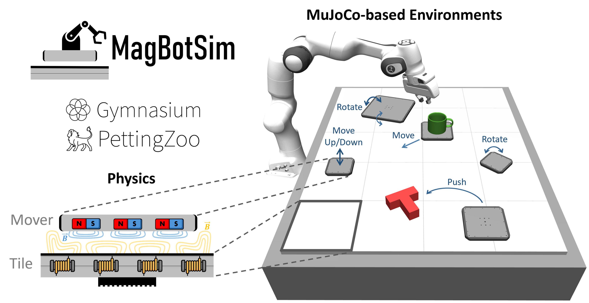

MagBotSim Documentation
=======================

|br|

MagBotSim (Magnetic Robotics Simulation) is a library for physics-based simulation environments for motion planning 
and object manipulation in the field of Magnetic Robotics. The main component of every environment is a 
*magnetic levitation (MagLev)* system, which consists of two basic components, as shown in the Figure above. Firstly, 
dynamically actuated shuttles as passive motor modules, so-called *movers*, consist of a housing and a complex permanent 
magnet structure based on Halbach arrays on the lower side of the mover. Secondly, static motor modules, so-called *tiles*, 
are the active component of the drive system. As shown in the Figure above, the tiles enable the coil-induced emission 
of electromagnetic fields (yellow) that interact with the mover's field (blue). During operation, the movers hover above the 
tiles and can be controlled in six dimensions by adjusting the currents in the coils contained in the tiles. 

A brief summary of our MagBotSim paper `MagBotSim: Physics-Based Simulation and Reinforcement Learning Environments for Magnetic Robotics <https://arxiv.org/abs/2511.16158>`_ (see :ref:`citation`) is shown in the following video:

.. raw:: html

   

      <iframe width="888" height="500"
            src="https://www.youtube.com/embed/JrNsR8JR9yo?autoplay=1&mute=1&loop=1&playlist=JrNsR8JR9yo"
            frameborder="0"
            allow="accelerometer; autoplay; clipboard-write; encrypted-media; gyroscope; picture-in-picture"
            allowfullscreen></iframe>
   

|br|

MagLev systems are already included in the first industrial applications. The most advanced systems available on the market 
are `XBot <https://www.planarmotor.com/?r=0>`_ (Planar Motor), 
`ACOPOS 6D <https://www.br-automation.com/en/products/mechatronic-systems/acopos-6d/>`_ (B&R), 
`XPlanar <https://www.beckhoff.com/en-us/products/motion/xplanar-planar-motor-system/>`_ (Beckhoff Automation), and 
`ctrlX FLOW⁶ᴰ  <https://apps.boschrexroth.com/microsites/ctrlx-automation/en/news-stories/story/bosch-rexroth-breaks-new-ground-with-the-planar-system-ctrlx-flow6d/>`_ (Bosch Rexroth). 
The industrial applications with MagLev systems typically focus on product transport and do not consider the 
manipulation of objects. However, to increase productivity and exploit the full potential of MagLev systems, material flow and 
manipulation should be combined in the future. Therefore, MagLev systems can be seen as a special kind of robot. Hence, we 
introduce the more general term *Magnetic Robotics*.

MagBotSim is designed to match real-world applications, so that control policies can be transferred to real MagLev systems without 
further training or calibration. Since the library is based on the `MuJoCo <https://mujoco.readthedocs.io/en/stable/overview.html>`_ 
physics engine, MagBotSim enables users to perform object manipulation tasks with MagLev systems. In addition, as reinforcement 
learning (RL) is frequently used in multi-agent path finding and object manipulation, MagBotSim includes basic environments with 
single-agent (`Gymnasium <https://gymnasium.farama.org/>`_) and multi-agent (`PettingZoo <https://pettingzoo.farama.org/>`_) RL 
APIs that can serve as starting points for developing new research-specific environments. However, MagBotSim can also be 
used without RL and provides several utilities, such as impedance control for the movers.

The following RL agents have been trained with MagBotSim:

.. raw:: html

   

      <iframe width="320" height="180"
            src="https://www.youtube.com/embed/qdemULBGtFc?autoplay=1&mute=1&loop=1&playlist=qdemULBGtFc"
            frameborder="0"
            allow="accelerometer; autoplay; clipboard-write; encrypted-media; gyroscope; picture-in-picture"
            allowfullscreen></iframe>

      <iframe width="320" height="180"
            src="https://www.youtube.com/embed/Y0U1cEfCQ9A?autoplay=1&mute=1&loop=1&playlist=Y0U1cEfCQ9A"
            frameborder="0"
            allow="accelerometer; autoplay; clipboard-write; encrypted-media; gyroscope; picture-in-picture"
            allowfullscreen></iframe>

      <iframe width="320" height="180"
            src="https://www.youtube.com/embed/GEhNS9mKXW8?autoplay=1&mute=1&loop=1&playlist=GEhNS9mKXW8"
            frameborder="0"
            allow="accelerometer; autoplay; clipboard-write; encrypted-media; gyroscope; picture-in-picture"
            allowfullscreen></iframe>
   

|br|

MagBotSim can also be used to develop trajectory planning policies that can be transferred to a real MagLev system:

.. raw:: html

   

      <iframe width="320" height="180"
            src="https://www.youtube.com/embed/pJvkNNimoTo?autoplay=1&mute=1&loop=1&playlist=pJvkNNimoTo"
            frameborder="0"
            allow="accelerometer; autoplay; clipboard-write; encrypted-media; gyroscope; picture-in-picture"
            allowfullscreen></iframe>

      <iframe width="320" height="180"
            src="https://www.youtube.com/embed/o_LCuxNir2w?autoplay=1&mute=1&loop=1&playlist=o_LCuxNir2w"
            frameborder="0"
            allow="accelerometer; autoplay; clipboard-write; encrypted-media; gyroscope; picture-in-picture"
            allowfullscreen></iframe>

   

|br|

.. _installation_license:

Installation & License
^^^^^^^^^^^^^^^^^^^^^^
MagBotSim is open-source and published under the GNU General Public License v3.0.
The MagBotSim package can be installed via PIP:

.. code:: bash

    pip install magbotsim

To install optional dependencies, to build the documentation, or to run the tests, use:

.. code:: bash

    pip install magbotsim[docs, tests]

.. note::
    Depending on your shell, e.g. when using Zsh, you may need to use additional quotation marks: 

    .. code:: bash
    
        pip install "magbotsim[docs, tests]"

Basic Usage
^^^^^^^^^^^
The following example shows how to use a trained policy with an example environment that follows the Gymnasium API:

.. code-block:: python

   import gymnasium as gym
   import magbotsim

   gym.register_envs(magbotsim)

   mover_params = {
      'shape': 'mesh',
      'mesh': {'mover_stl_path': 'beckhoff_apm4220_mover', 'bumper_stl_path': 'beckhoff_apm4220_bumper'},
      'mass': 0.639 - 0.034,
      'bumper_mass': 0.034,
   }
   env_kwargs = {
      'mover_params': mover_params,
      'initial_mover_zpos': 0.002,
      'render_mode': 'human',
      'render_every_cycle': True,
   }

   env = gym.make("StateBasedPushTEnv-v0", **env_kwargs)
   observation, info = env.reset(seed=42)

   for _ in range(0,100):
      terminated, truncated = False, False
      while not terminated and not truncated:
         action = env.action_space.sample()  # use custom policy instead
         observation, reward, terminated, truncated, info = env.step(action)

      observation, info = env.reset()
   env.close()

Due to the use of standard RL APIs, MagBotSim is compatible with common RL libraries, such as `Stable-Baselines3 <https://stable-baselines3.readthedocs.io/en/master/>`_  
or `Tianshou <https://tianshou.org/en/stable/>`_.
The library contains a collection of existing RL environments in the field of Magnetic Robotics, which will continue to be updated in the future, as well as basic single-agent and 
multi-agent environments that serve as starting points for the easy development of new research-specific environments.

.. _citation:

Paper & Citation
^^^^^^^^^^^^^^^^
If you use MagBotSim for your research, please cite our paper `MagBotSim: Physics-Based Simulation and Reinforcement Learning Environments for Magnetic Robotics <https://arxiv.org/abs/2511.16158>`_
as follows:

.. code-block:: bibtex

   @aricle{bergmann_magbotsim_2025,
      title = {{MagBotSim}: {Physics}-{Based} {Simulation} and {Reinforcement} {Learning} {Environments} for {Magnetic} {Robotics}},
      author = {Bergmann, Lara and Grothues, Cedric and Neumann, Klaus},
      journal = {arXiv preprint arXiv:2511.16158},
      year = {2025},
      doi = {10.48550/ARXIV.2511.16158}
   }

Learn More
^^^^^^^^^^

.. toctree::
   :maxdepth: 2

   environments
   api_reference
   examples_tutorials
   benchmarks
   changelog

.. |br| raw:: html

       
